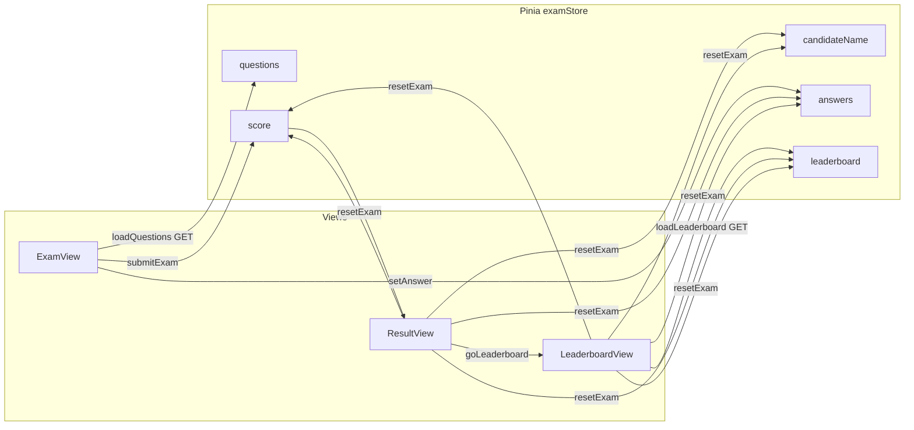
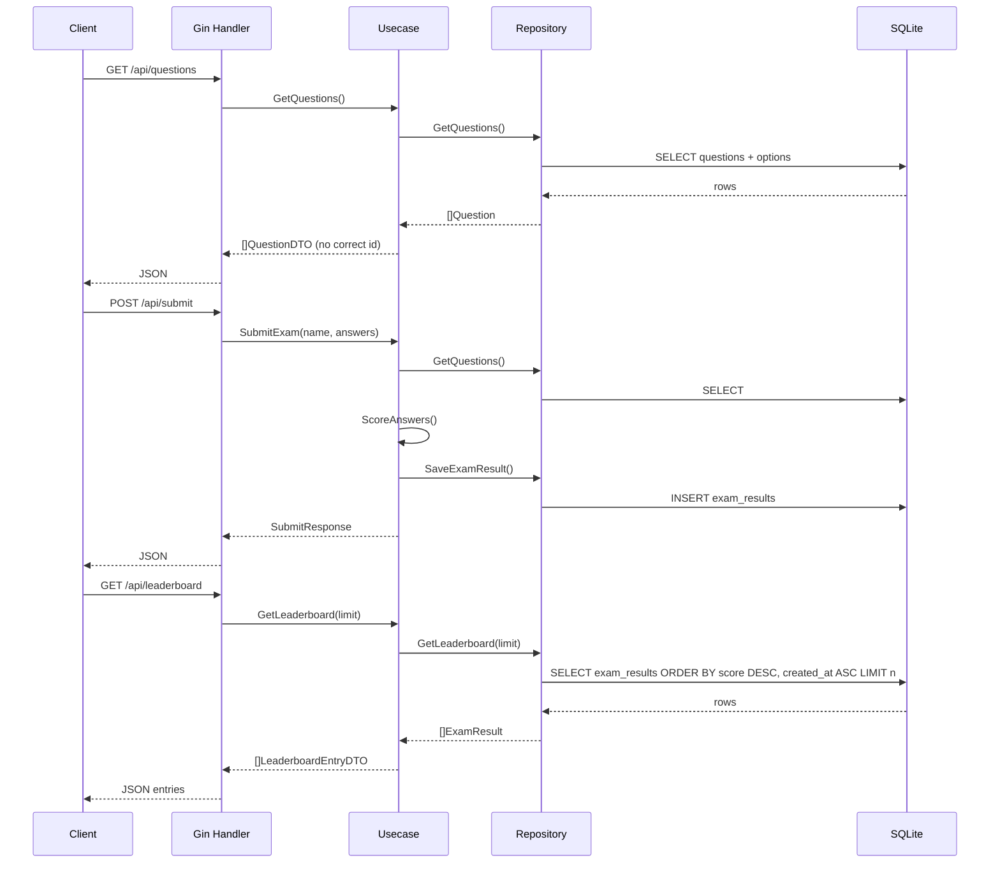

# Architecture & Tech Stack (Full Stack)

## Table of contents

- [Architecture \& Tech Stack (Full Stack)](#architecture--tech-stack-full-stack)
  - [Table of contents](#table-of-contents)
  - [Overview](#overview)
  - [Application flow (user → system)](#application-flow-user--system)
  - [Backend use case flow](#backend-use-case-flow)
  - [Data flow](#data-flow)
  - [API contract summary (`api.md`)](#api-contract-summary-apimd)
  - [Diagram — Frontend relationships](#diagram--frontend-relationships)
  - [Diagram — Backend request sequence](#diagram--backend-request-sequence)
  - [Frontend tech stack](#frontend-tech-stack)
  - [Backend tech stack](#backend-tech-stack)
  - [Why Vue 3 + Pinia](#why-vue-3--pinia)
  - [Why Go + Gin + SQLite](#why-go--gin--sqlite)
  - [Frontend folder layout](#frontend-folder-layout)
  - [Backend folder layout (Pragmatic Clean Architecture)](#backend-folder-layout-pragmatic-clean-architecture)
  - [Frontend and backend communication](#frontend-and-backend-communication)

## Overview

The system consists of a **Frontend SPA** (Vue 3) where candidates enter a name, take a single-choice exam, and view their score, and a **Backend API** (Go + Gin) that stores questions/answers in SQLite, accepts submissions, computes scores on the server, and persists exam results.

The frontend separates UI (Vue), routing (Vue Router), and transient state (Pinia). The backend separates HTTP (Handler), business rules (Use case), and data access (Repository + GORM).

**File-by-file reading with line numbers:** [code_analyze.md](./code_analyze.md)  
**Endpoints and JSON examples:** [api.md](./api.md)

## Application flow (user → system)

<<<<<<< HEAD
1. ผู้ใช้เปิดเว็บ → Vite โหลด bundle จาก `main.js` → แสดง `App.vue` → `RouterView` ตาม path
2. Path `/` โหลด `ExamView` → `onMounted` เรียก **`GET /api/questions`** (ผ่าน `examStore.loadQuestions()`)
3. **สำเร็จ:** เก็บรายการคำถามใน Pinia  
   **ล้มเหลว:** เคลียร์ `questions`, ตั้ง `loadError`, แสดงข้อความแจ้งเตือน — ไม่มีข้อสอบในเครื่อง
4. ผู้ใช้กรอกชื่อและเลือกคำตอบ → `setAnswer` อัปเดต `answers`
5. กดส่ง → ตรวจชื่อและครบทุกข้อ → **`POST /api/submit`** พร้อม `{ candidateName, answers }` → ได้ `score` จากเซิร์ฟเวอร์ → นำทางไป `/result`
6. `ResultView` แสดงชื่อและคะแนน → **View Leaderboard** → `/leaderboard` → `LeaderboardView` เรียก **`GET /api/leaderboard`** (`loadLeaderboard`) หรือ **Retake** → `resetExam()`
7. `LeaderboardView` ปุ่ม **Back to Exam** → `resetExam()` (เคลียร์ชื่อ/คำตอบ/คะแนน/leaderboard กลับ `/` — ไม่เคลียร์รายการข้อเพื่อลดการเรียก `GET /api/questions` ซ้ำ)
=======
1. User opens the site → Vite loads the bundle from `main.js` → `App.vue` → `RouterView` for the path
2. Path `/` loads `ExamView` → `onMounted` calls **`GET /api/questions`** (via `examStore.loadQuestions()`)
3. **Success:** questions stored in Pinia  
   **Failure:** clear `questions`, set `loadError`, show a message — no offline question set
4. User enters name and selects answers → `setAnswer` updates `answers`
5. Submit → validate name and all questions answered → **`POST /api/submit`** with `{ candidateName, answers }` → receive `score` from server → navigate to `/result`
6. `ResultView` shows name and score → Retake → `resetExam()` (clears name/answers/score, returns to `/` — does not clear questions to avoid redundant GETs)
>>>>>>> 59f10ee (Refactor documentation for clarity and consistency; update execute.md, README.md, RULE.md, and various API references to enhance user understanding and maintainability.)

**DevTools / duplicate API calls:** see [api.md](./api.md)

## Backend use case flow

| Step | Owner | What happens |
|------|----------------|------------------|
<<<<<<< HEAD
| HTTP | `handler.ExamHTTP` | รับ request, bind JSON, สถานะ HTTP |
| กฎธุรกิจ | `usecase.Exam` | `GetQuestions`: ดึงจาก store → แปลงเป็น DTO **ไม่ส่งเฉลย** |
| | | `SubmitExam`: ดึงคำถามพร้อมเฉลยจาก DB → `ScoreAnswers` → สร้าง `ExamResult` (รวม JSON คำตอบ) → `SaveExamResult` |
| | | `GetLeaderboard`: ดึง `ExamResult` จาก store → map เป็น `LeaderboardEntryDTO` (ไม่ส่ง `answers`) |
| ข้อมูล | `repository.QuestionGorm` / `ExamResultGorm` | GORM อ่าน/เขียน SQLite — `GetLeaderboard` เรียง `score DESC`, `created_at ASC` |
=======
| HTTP | `handler.ExamHTTP` | Accept request, bind JSON, HTTP status |
| Business rules | `usecase.Exam` | `GetQuestions`: load from store → map to DTO **without answers** |
| | | `SubmitExam`: load questions with answers from DB → `ScoreAnswers` → build `ExamResult` (including answer JSON) → `SaveExamResult` |
| Data | `repository.QuestionGorm` / `ExamResultGorm` | GORM read/write SQLite |
>>>>>>> 59f10ee (Refactor documentation for clarity and consistency; update execute.md, README.md, RULE.md, and various API references to enhance user understanding and maintainability.)

## Data flow

**Load questions (GET)**

- **DB:** `questions` + `options` tables (`correct_option_id` per question — not exposed via API)
- **Repository** → **Use case** strips answers → **Handler** → JSON `{ "questions": [...] }`
- **Frontend** stores in `examStore.questions` for display and `answers`

**Submit (POST)**

- **Frontend** sends `candidateName` and `answers` (keys are string question ids)
- **Use case** loads questions + answers from DB as before → compares to `answers` → `score`, `total`
- **DB:** `INSERT` into `exam_results` (name, score, total, `answers_json`)

<<<<<<< HEAD
**กระดานอันดับ (GET)**

- **DB:** อ่าน `exam_results` — เรียงคะแนนสูงสุดก่อน ถ้าคะแนนเท่ากันให้ `created_at` เก่าก่อน (สอบก่อนอยู่บน)
- **Repository** → **Usecase** ใส่ `rank` และตัดข้อมูลลึก → **Handler** → JSON `{ "entries": [...] }`
- **Frontend** เก็บใน `examStore.leaderboard` สำหรับ `LeaderboardView`

## สรุปเทียบสัญญา API (`api.md`)
=======
## API contract summary (`api.md`)
>>>>>>> 59f10ee (Refactor documentation for clarity and consistency; update execute.md, README.md, RULE.md, and various API references to enhance user understanding and maintainability.)

| Topic | Status |
|--------|--------|
<<<<<<< HEAD
| `GET /api/questions` ไม่ส่ง `correctOptionId` | ตรง — DTO ใน usecase ไม่มีฟิลด์เฉลย |
| `POST /api/submit` body `candidateName`, `answers` (คีย์ string) | ตรง |
| Response `{ candidateName, score, total }` | ตรง — หน้าผลใช้ `score` และ `totalQuestions` (= จำนวนข้อที่โหลด) ซึ่งควรสอดคล้อง `total` |
| `GET /api/leaderboard` → `{ entries: LeaderboardEntryDTO[] }` | ตรง — อันดับจาก `exam_results` เรียงคะแนนมากไปน้อย แล้ว `created_at` เก่าก่อน |
=======
| `GET /api/questions` does not send `correctOptionId` | OK — use case DTO has no answer fields |
| `POST /api/submit` body `candidateName`, `answers` (string keys) | OK |
| Response `{ candidateName, score, total }` | OK — result view uses `score` and `totalQuestions` (= loaded count), which should align with `total` |
>>>>>>> 59f10ee (Refactor documentation for clarity and consistency; update execute.md, README.md, RULE.md, and various API references to enhance user understanding and maintainability.)

Details and examples: [api.md](./api.md)

## Diagram — Frontend relationships



## Diagram — Backend request sequence



## Frontend tech stack

| Technology | Role |
|-----------|--------|
| **Vue 3** | UI framework — Composition API + `<script setup>` |
<<<<<<< HEAD
| **Vite** | build และ dev server |
| **Tailwind CSS** | สไตล์ utility-first, responsive, mobile-first |
| **Vue Router** | เส้นทาง `/` (ทำข้อสอบ), `/result` (ผล), `/leaderboard` (กระดานอันดับ) |
| **Pinia** | state ชื่อผู้สอบ, คำถาม, คำตอบ, คะแนน, leaderboard — โหลดข้อสอบและอันดับจาก API เท่านั้น |
=======
| **Vite** | Build and dev server |
| **Tailwind CSS** | Utility-first styling, responsive, mobile-first |
| **Vue Router** | Routes for exam (IT 10-1) and result (IT 10-2) |
| **Pinia** | State: candidate name, questions, answers, score — loads questions from API only |
>>>>>>> 59f10ee (Refactor documentation for clarity and consistency; update execute.md, README.md, RULE.md, and various API references to enhance user understanding and maintainability.)

## Backend tech stack

| Technology | Role |
|-----------|--------|
| **Go** | Language and runtime |
| **Gin** | HTTP router / middleware |
| **GORM** | ORM for SQLite |
| **SQLite** | Single-file DB (`backend/data/exam.db`) — zero extra install |
| **testify** | `assert` + `mock` for use case unit tests |

## Why Vue 3 + Pinia

- **Vue 3** Composition API groups logic by feature clearly
- **Pinia** keeps **exam** state out of components so `ExamView` / `ResultView` focus on UI and events

## Why Go + Gin + SQLite

- **Go** — simple single-binary deploy, clear concurrency
- **Gin** — widely used, middleware fits REST
- **SQLite** — good for learning/demos — no separate DB server; can move to PostgreSQL when scaling
- **Pragmatic Clean Architecture**: handler → use case → repository — test use cases with mock repositories without touching SQLite

## Frontend folder layout

- `frontend/src/views/` — main screens per route
- `frontend/src/components/` — reusable subcomponents
- `frontend/src/stores/` — Pinia (`examStore`)
- `frontend/src/router/` — routes and meta (title)
- `frontend/src/api/` — HTTP (`client.js`)
- `frontend/src/assets/` — global CSS and Tailwind theme

## Backend folder layout (Pragmatic Clean Architecture)

```
backend/
├── cmd/api/main.go          # entry, SQLite path, AutoMigrate, seed, DI, Gin
├── internal/
│   ├── models/              # Question, Option, ExamResult
│   ├── repository/          # GORM: GetQuestions, SaveExamResult, GetLeaderboard, migrate, seed
│   ├── usecase/             # Exam, ports (interfaces), ScoreAnswers, GetLeaderboard
│   └── handler/             # Gin: GET /api/questions, POST /api/submit, GET /api/leaderboard
├── go.mod
└── data/exam.db             # created at run time (in .gitignore)
```

<<<<<<< HEAD
- **Handler** รับ/ส่ง JSON ไม่มี business logic หนัก
- **Usecase** รวม `GetQuestions` (map เป็น DTO ไม่ส่งเฉลย), `SubmitExam` (ดึงเฉลยจาก DB → คำนวณคะแนน → `SaveExamResult`), `GetLeaderboard` (DTO อันดับ ไม่ส่งคำตอบดิบ)
- **Repository** คุยกับ GORM/SQLite เท่านั้น — รวม `GetLeaderboard` สำหรับอ่าน `exam_results`
=======
- **Handler** — JSON in/out, minimal business logic
- **Use case** — `GetQuestions` (map to DTO without answers), `SubmitExam` (load answers from DB → score → `SaveExamResult`)
- **Repository** — GORM/SQLite only
>>>>>>> 59f10ee (Refactor documentation for clarity and consistency; update execute.md, README.md, RULE.md, and various API references to enhance user understanding and maintainability.)

Endpoint details and JSON examples: [api.md](./api.md)

## Frontend and backend communication

In short: API base `http://localhost:8080` — full tables and payloads in [api.md](./api.md)

More planning and roadmap: [planning.md](./planning.md)
