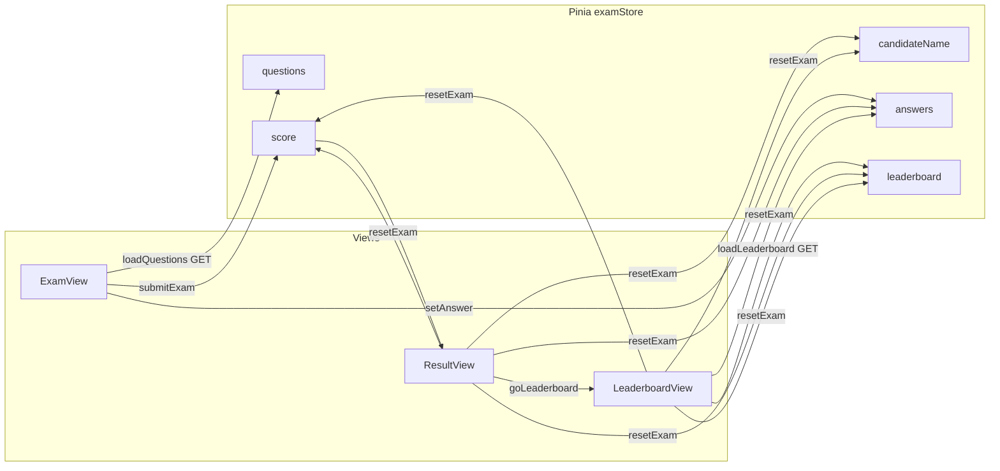
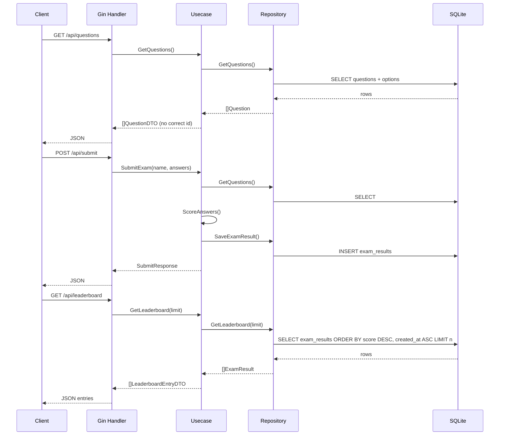

# Architecture & Tech Stack (Full Stack)

## สารบัญ

- [Architecture \& Tech Stack (Full Stack)](#architecture--tech-stack-full-stack)
  - [สารบัญ](#สารบัญ)
  - [ภาพรวม](#ภาพรวม)
  - [Flow การทำงาน (ผู้ใช้ → ระบบ)](#flow-การทำงาน-ผู้ใช้--ระบบ)
  - [Flow use case ฝั่ง Backend](#flow-use-case-ฝั่ง-backend)
  - [Data flow](#data-flow)
  - [สรุปเทียบสัญญา API (`api.md`)](#สรุปเทียบสัญญา-api-apimd)
  - [Diagram — ความสัมพันธ์ Frontend](#diagram--ความสัมพันธ์-frontend)
  - [Diagram — ลำดับคำขอ Backend](#diagram--ลำดับคำขอ-backend)
  - [Tech stack ฝั่ง Frontend](#tech-stack-ฝั่ง-frontend)
  - [Trade-off: Node.js + npm กับ Bun (เครื่องมือ frontend)](#trade-off-nodejs--npm-กับ-bun-เครื่องมือ-frontend)
  - [Tech stack ฝั่ง Backend](#tech-stack-ฝั่ง-backend)
  - [เหตุผลที่เลือก Vue 3 + Pinia](#เหตุผลที่เลือก-vue-3--pinia)
  - [เหตุผลที่เลือก Go + Gin + SQLite](#เหตุผลที่เลือก-go--gin--sqlite)
  - [โครงสร้างโฟลเดอร์ Frontend](#โครงสร้างโฟลเดอร์-frontend)
  - [โครงสร้างโฟลเดอร์ Backend (Pragmatic Clean Architecture)](#โครงสร้างโฟลเดอร์-backend-pragmatic-clean-architecture)
  - [การสื่อสารระหว่าง FE กับ BE](#การสื่อสารระหว่าง-fe-กับ-be)

## ภาพรวม

ระบบประกอบด้วย **SPA ฝั่ง Frontend** (Vue 3) ให้ผู้สอบกรอกชื่อ ทำข้อสอบแบบเลือกคำตอบเดียว และดูคะแนน และ **API ฝั่ง Backend** (Go + Gin) ที่เก็บข้อสอบ/เฉลยใน SQLite รับการส่งข้อสอบ คำนวณคะแนนที่เซิร์ฟเวอร์ และบันทึกผลการสอบ

ฝั่ง Frontend แยก UI (Vue), การนำทาง (Vue Router), และ state ชั่วคราว (Pinia) ฝั่ง Backend แยก HTTP (Handler), กฎธุรกิจ (Use case), และการเข้าถึงข้อมูล (Repository + GORM)

**อ่านโค้ดทีละไฟล์พร้อมเลขบรรทัด:** [code_analyze.md](./code_analyze.md)  
**Endpoint และตัวอย่าง JSON:** [api.md](./api.md)

## Flow การทำงาน (ผู้ใช้ → ระบบ)

1. ผู้ใช้เปิดเว็บ → Vite โหลด bundle จาก `main.js` → `App.vue` → `RouterView` ตาม path
2. Path `/` โหลด `ExamView` → `onMounted` เรียก **`GET /api/questions`** (ผ่าน `examStore.loadQuestions()`)
3. **สำเร็จ:** เก็บคำถามใน Pinia  
   **ล้มเหลว:** เคลียร์ `questions`, ตั้ง `loadError`, แสดงข้อความ — ไม่มีชุดข้อสอบออฟไลน์
4. ผู้ใช้กรอกชื่อและเลือกคำตอบ → `setAnswer` อัปเดต `answers`
5. กดส่ง → ตรวจชื่อและความครบ · **ถ้ามีข้อที่ยังไม่ตอบ:** แสดงข้อความใต้ปุ่ม ไฮไลต์การ์ดทุกข้อที่ยังไม่ตอบด้วยกรอบแดง และเลื่อนไปข้อแรกที่ว่าง (ไม่เรียก API) · **ถ้าครบ:** **`POST /api/submit`** พร้อม `{ candidateName, answers }` → เซิร์ฟเวอร์ปฏิเสธชื่อซ้ำหลัง trim (`409`) และกรณีชื่อว่าง (`400`) — UI แสดงข้อความที่ช่องชื่อและเลื่อนไปที่ช่องนั้น · **สำเร็จ:** ได้ `score` จากเซิร์ฟเวอร์ → ไป `/result`
6. `ResultView` แสดงชื่อและคะแนน → **View Leaderboard** → `/leaderboard` → `LeaderboardView` เรียก **`GET /api/leaderboard`** (`loadLeaderboard`) หรือ **Retake** → `resetExam()`
7. ปุ่ม **Back to Exam** ใน `LeaderboardView` → `resetExam()` (เคลียร์ชื่อ/คำตอบ/คะแนน/leaderboard กลับ `/` — ไม่เคลียร์คำถามเพื่อลดการเรียก `GET /api/questions` ซ้ำ)

**DevTools / การเรียก API ซ้ำ:** ดู [api.md](./api.md)

## Flow use case ฝั่ง Backend

| ขั้น | ผู้รับผิดชอบ | สิ่งที่เกิดขึ้น |
|------|----------------|------------------|
| HTTP | `handler.ExamHTTP` | รับ request, bind JSON, สถานะ HTTP |
| กฎธุรกิจ | `usecase.Exam` | `GetQuestions`: โหลดจาก store → map เป็น DTO **ไม่มีเฉลย** |
| | | `SubmitExam`: trim ชื่อ → `CandidateNameExists` (ซ้ำแล้ว error) → โหลดคำถาม → `ScoreAnswers` → สร้าง `ExamResult` → `SaveExamResult` |
| | | `GetLeaderboard`: โหลด `ExamResult` จาก store → map เป็น `LeaderboardEntryDTO` (ไม่รวม `answers`) |
| ข้อมูล | `repository.QuestionGorm` / `ExamResultGorm` | GORM อ่าน/เขียน SQLite — `GetLeaderboard` เรียง `score DESC`, `created_at ASC` |

## Data flow

**โหลดข้อสอบ (GET)**

- **DB:** ตาราง `questions` + `options` (`correct_option_id` ต่อข้อ — ไม่ส่งผ่าน API)
- **Repository** → **Use case** ตัดเฉลย → **Handler** → JSON `{ "questions": [...] }`
- **Frontend** เก็บใน `examStore.questions` สำหรับแสดงและ `answers`

**ส่งข้อสอบ (POST)**

- **Frontend** ส่ง `candidateName` และ `answers` (คีย์เป็น string ของ question id)
- **Use case** ตรวจชื่อไม่ซ้ำ → โหลดคำถามและเฉลยจาก DB → เทียบกับ `answers` → `score`, `total`
- **DB:** `INSERT` ลง `exam_results` (ชื่อ, คะแนน, รวมข้อ, `answers_json`) — เก็บชื่อหลัง trim; การห้ามซ้ำทำที่ชั้นแอป (เทียบ `candidate_name` ตรง)

**Leaderboard (GET)**

- **DB:** อ่าน `exam_results` — เรียงคะแนนสูงสุดก่อน; ถ้าคะแนนเท่ากันให้ `created_at` เก่าก่อน
- **Repository** → **Use case** ใส่ `rank` และตัดข้อมูลลึก → **Handler** → JSON `{ "entries": [...] }`
- **Frontend** เก็บใน `examStore.leaderboard` สำหรับ `LeaderboardView`

## สรุปเทียบสัญญา API (`api.md`)

| หัวข้อ | สถานะ |
|--------|--------|
| `GET /api/questions` ไม่ส่ง `correctOptionId` | OK — DTO ใน use case ไม่มีฟิลด์เฉลย |
| `POST /api/submit` body `candidateName`, `answers` (คีย์ string) | OK |
| Response `{ candidateName, score, total }` | OK — หน้าผลใช้ `score` และ `totalQuestions` (= จำนวนข้อที่โหลด) ซึ่งควรสอดคล้อง `total` |
| `GET /api/leaderboard` → `{ entries: LeaderboardEntryDTO[] }` | OK — อันดับจาก `exam_results` เรียงคะแนนมากไปน้อย แล้ว `created_at` เก่าก่อน |

รายละเอียดและตัวอย่าง: [api.md](./api.md)

## Diagram — ความสัมพันธ์ Frontend



## Diagram — ลำดับคำขอ Backend



## Tech stack ฝั่ง Frontend

| เทคโนโลยี | บทบาท |
|-----------|--------|
| **Vue 3** | UI framework — Composition API + `<script setup>` |
| **Vite** | Build และ dev server |
| **Tailwind CSS** | Utility-first, responsive, mobile-first |
| **Vue Router** | เส้นทาง `/` (สอบ), `/result` (คะแนน), `/leaderboard` (อันดับ) |
| **Pinia** | State: ชื่อผู้สอบ, คำถาม, คำตอบ, คะแนน, leaderboard — โหลดคำถามและอันดับจาก API เท่านั้น |
| **Node.js + npm** | เครื่องมือ dev/build สำหรับ Vite (ดู trade-off ด้านล่าง) |

## Trade-off: Node.js + npm กับ Bun (เครื่องมือ frontend)

สำหรับ **Vue 3 + Vite** ใน repo นี้ เราใช้ **Node.js กับ npm** เป็น **ค่าเริ่มต้นที่ปลอดภัย** สำหรับการพัฒนาและ build แบบ CI

**Bun** ได้รับความนิยมเป็น **ชุด all-in-one**: ติดตั้งแพ็กเกจเร็วมาก (บ่อยครั้งเร็วกว่า npm หลายเท่าในโปรเจกต์ทั่วไป), binary เดียวทั้ง runtime + package manager และรัน **TypeScript** แบบ native โดยไม่ต้องคอมไพล์แยกในหลาย workflow — ข้อดีเหล่านี้สำคัญเมื่อทีมยึด Bun แบบ end-to-end

**ทำไมยังใช้ Node + npm ที่นี่**

- **สอดคล้อง ecosystem หลัก** — Vite, เอกสาร Vue 3 และปลั๊กอินส่วนใหญ่สมมติ **Node** ก่อน การอยู่บน Node ลดเซอร์ไพรส์การผสาน (“ใช้ได้แค่บน Bun”) สำหรับโค้ดเรียนรู้/ประเมิน
- **เสถียรภาพมากกว่าความใหม่** — runtime ใหม่อาจเจอ **edge case** (native dependency, สคริปต์ที่เรียก `node`, พฤติกรรม semver ละเอียด) Node เป็นทางเลือกที่ **คาดการณ์ได้** สำหรับผู้ร่วมพัฒนาและผู้ review
- **คำสั่งมาตรฐาน ไม่ต้องติดตั้งเพิ่ม** — ผู้ให้คะแนนและผู้ร่วมโปรเจกต์ทำตาม **`npm install`** / **`npm run dev`** ด้วย Node LTS ตามที่ระบุใน [README.md](../README.md) และ [frontend/README.md](../frontend/README.md)

Node ยังเป็น **ค่าเริ่มต้นหลัก** ในหลายองค์กร บทเรียน และ base image; ความคุ้นเคยร่วมกันลดแรงเสียดทาน onboarding แม้ Bun จะเป็นทางเลือกที่ดีในที่อื่น

**สรุป:** Bun แลก **ความเร็วและการรวมเครื่องมือสูงสุด** กับ **ความเข้ากันได้ที่สมมติกว้างกว่า** เมื่อเลือก Node + npm — โปรเจกต์นี้ให้ความสำคัญข้อหลัง ทีมที่ยอมรับการตรวจความเข้ากันได้อาจใช้ Bun ในเครื่องได้; แอปไม่พึ่ง API เฉพาะ Bun

## Tech stack ฝั่ง Backend

| เทคโนโลยี | บทบาท |
|-----------|--------|
| **Go** | ภาษาและ runtime |
| **Gin** | HTTP router / middleware |
| **GORM** | ORM สำหรับ SQLite |
| **SQLite** | DB ไฟล์เดียว (`backend/data/exam.db`) — ไม่ต้องติดตั้งเซิร์ฟเวอร์ DB แยก |
| **testify** | `assert` + `mock` สำหรับ unit test use case |

## เหตุผลที่เลือก Vue 3 + Pinia

- **Vue 3** Composition API จัดกลุ่ม logic ตาม feature ได้ชัด
- **Pinia** แยก state ของ **exam** ออกจากคอมโพเนนต์ จึงให้ `ExamView` / `ResultView` โฟกัส UI และ event

## เหตุผลที่เลือก Go + Gin + SQLite

- **Go** — deploy binary เดียวง่าย, concurrency ชัด
- **Gin** — ใช้กันแพร่หลาย, middleware เหมาะ REST
- **SQLite** — เหมาะเรียน/สาธิต — ไม่มี DB server แยก; ย้ายไป PostgreSQL เมื่อต้อง scale
- **Pragmatic Clean Architecture**: handler → use case → repository — ทดสอบ use case ด้วย mock repository โดยไม่แตะ SQLite

## โครงสร้างโฟลเดอร์ Frontend

- `frontend/src/views/` — หน้าหลักตาม route
- `frontend/src/components/` — คอมโพเนนต์ย่อยใช้ซ้ำ
- `frontend/src/stores/` — Pinia (`examStore`)
- `frontend/src/router/` — เส้นทางและ meta (title)
- `frontend/src/api/` — HTTP (`client.js`)
- `frontend/src/assets/` — CSS ทั่วทั้งแอปและธีม Tailwind

## โครงสร้างโฟลเดอร์ Backend (Pragmatic Clean Architecture)

```
backend/
├── cmd/api/main.go          # entry, `.env` (optional) (PORT, DATABASE_DIR), SQLite, AutoMigrate, seed, DI, Gin
├── internal/
│   ├── models/              # Question, Option, ExamResult
│   ├── repository/          # GORM: GetQuestions, SaveExamResult, GetLeaderboard, migrate, seed
│   ├── usecase/             # Exam, ports (interfaces), ScoreAnswers, GetLeaderboard
│   └── handler/             # Gin: GET /api/questions, POST /api/submit, GET /api/leaderboard
├── scripts/                 # SQL ช่วย dev (mock/clear exam_results) — ไม่อยู่ใต้ cmd/ (cmd = เฉพาะ main)
├── go.mod
└── data/exam.db             # สร้างตอนรัน (ใน .gitignore)
```

- **Handler** — JSON เข้า/ออก, business logic เล็กน้อย
- **Use case** — `GetQuestions` (map เป็น DTO ไม่มีเฉลย), `SubmitExam` (โหลดเฉลยจาก DB → คิดคะแนน → `SaveExamResult`), `GetLeaderboard` (DTO อันดับ ไม่ส่งคำตอบดิบ)
- **Repository** — GORM/SQLite เท่านั้น — รวม `GetLeaderboard` สำหรับอ่าน `exam_results`

รายละเอียด endpoint และตัวอย่าง JSON: [api.md](./api.md)

## การสื่อสารระหว่าง FE กับ BE

สรุปสั้น: ฐาน API `http://localhost:8080` — ตารางและ payload ฉบับเต็มใน [api.md](./api.md)

แผนงานและ roadmap เพิ่มเติม: [planning.md](./planning.md)
