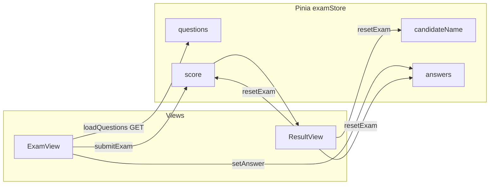
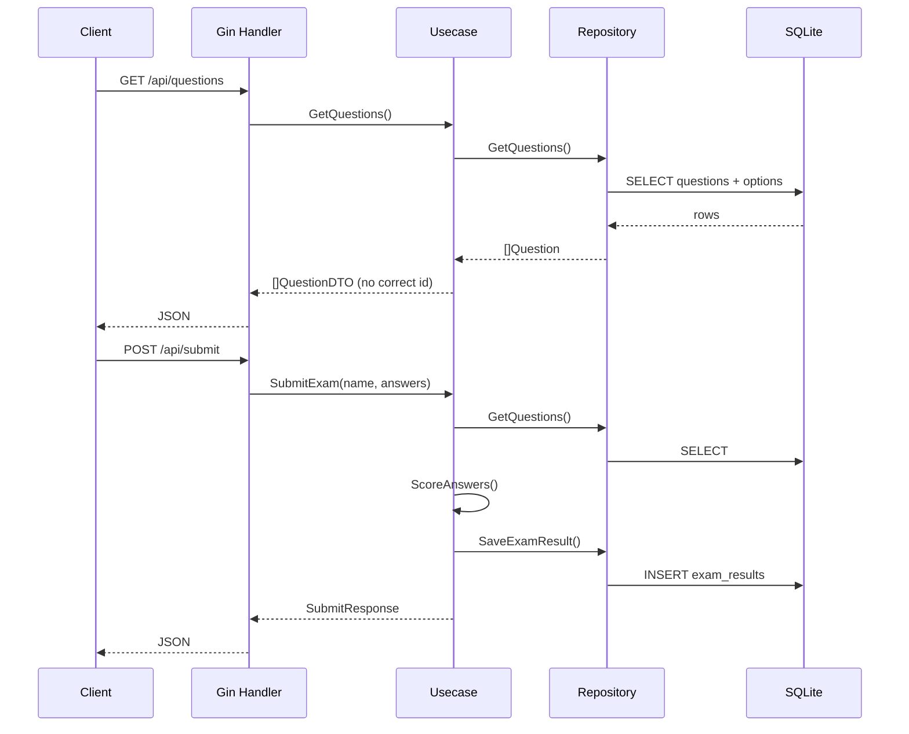

# Architecture & Tech Stack (Full Stack)

## สารบัญ

- [Architecture \& Tech Stack (Full Stack)](#architecture--tech-stack-full-stack)
  - [สารบัญ](#สารบัญ)
  - [ภาพรวม](#ภาพรวม)
  - [Flow การทำงานของโปรแกรม (ผู้ใช้ → ระบบ)](#flow-การทำงานของโปรแกรม-ผู้ใช้--ระบบ)
  - [Flow usecase ฝั่ง Backend](#flow-usecase-ฝั่ง-backend)
  - [Flow การไหลของข้อมูล (Data flow)](#flow-การไหลของข้อมูล-data-flow)
  - [สรุปเทียบสัญญา API (`api.md`)](#สรุปเทียบสัญญา-api-apimd)
  - [Diagram — ความสัมพันธ์ Frontend](#diagram--ความสัมพันธ์-frontend)
  - [Diagram — ลำดับคำขอ Backend](#diagram--ลำดับคำขอ-backend)
  - [Tech Stack ฝั่ง Frontend](#tech-stack-ฝั่ง-frontend)
  - [Tech Stack ฝั่ง Backend](#tech-stack-ฝั่ง-backend)
  - [เหตุผลที่เลือก Vue 3 + Pinia](#เหตุผลที่เลือก-vue-3--pinia)
  - [เหตุผลที่เลือก Go + Gin + SQLite](#เหตุผลที่เลือก-go--gin--sqlite)
  - [โครงสร้างโฟลเดอร์ Frontend](#โครงสร้างโฟลเดอร์-frontend)
  - [โครงสร้างโฟลเดอร์ Backend (Pragmatic Clean Architecture)](#โครงสร้างโฟลเดอร์-backend-pragmatic-clean-architecture)
  - [การสื่อสารระหว่าง FE / BE](#การสื่อสารระหว่าง-fe--be)

## ภาพรวม

ระบบประกอบด้วย **SPA ฝั่ง Frontend** (Vue 3) สำหรับผู้สอบกรอกชื่อ ทำข้อสอบแบบเลือกคำตอบเดียว และดูผลคะแนน และ **API ฝั่ง Backend** (Go + Gin) ที่จัดเก็บข้อสอบ/เฉลยใน SQLite รับการส่งข้อสอบ คำนวณคะแนนที่ฝั่งเซิร์ฟเวอร์ และบันทึกผลการสอบ

ชั้น Frontend แยก UI (Vue), การนำทาง (Vue Router) และ state ชั่วคราว (Pinia) ชั้น Backend แยก HTTP (Handler), กฎธุรกิจ (Usecase), และการเข้าถึงข้อมูล (Repository + GORM)

**อ่านโค้ดทีละไฟล์และเลขบรรทัด:** [code_analyze.md](./code_analyze.md)  
**Endpoint และตัวอย่าง JSON:** [api.md](./api.md)

## Flow การทำงานของโปรแกรม (ผู้ใช้ → ระบบ)

1. ผู้ใช้เปิดเว็บ → Vite โหลด bundle จาก `main.js` → แสดง `App.vue` → `RouterView` ตาม path
2. Path `/` โหลด `ExamView` → `onMounted` เรียก **`GET /api/questions`** (ผ่าน `examStore.loadQuestions()`)
3. **สำเร็จ:** เก็บรายการคำถามใน Pinia  
   **ล้มเหลว:** เคลียร์ `questions`, ตั้ง `loadError`, แสดงข้อความแจ้งเตือน — ไม่มีข้อสอบในเครื่อง
4. ผู้ใช้กรอกชื่อและเลือกคำตอบ → `setAnswer` อัปเดต `answers`
5. กดส่ง → ตรวจชื่อและครบทุกข้อ → **`POST /api/submit`** พร้อม `{ candidateName, answers }` → ได้ `score` จากเซิร์ฟเวอร์ → นำทางไป `/result`
6. `ResultView` แสดงชื่อและคะแนน → Retake → `resetExam()` (เคลียร์ชื่อ/คำตอบ/คะแนน กลับ `/` — ไม่เคลียร์รายการข้อเพื่อลดการเรียก GET ซ้ำ)

**Troubleshooting DevTools / การเรียก API ซ้ำ:** ดู [api.md](./api.md)

## Flow usecase ฝั่ง Backend

| ขั้น | ผู้รับผิดชอบ | สิ่งที่เกิดขึ้น |
|------|----------------|------------------|
| HTTP | `handler.ExamHTTP` | รับ request, bind JSON, สถานะ HTTP |
| กฎธุรกิจ | `usecase.Exam` | `GetQuestions`: ดึงจาก store → แปลงเป็น DTO **ไม่ส่งเฉลย** |
| | | `SubmitExam`: ดึงคำถามพร้อมเฉลยจาก DB → `ScoreAnswers` → สร้าง `ExamResult` (รวม JSON คำตอบ) → `SaveExamResult` |
| ข้อมูล | `repository.QuestionGorm` / `ExamResultGorm` | GORM อ่าน/เขียน SQLite |

## Flow การไหลของข้อมูล (Data flow)

**อ่านข้อสอบ (GET)**

- **DB:** ตาราง `questions` + `options` (มี `correct_option_id` ที่ข้อ — ไม่ส่งออก API)
- **Repository** → **Usecase** ตัดเฉลยออก → **Handler** → JSON `{ "questions": [...] }`
- **Frontend** เก็บใน `examStore.questions` สำหรับแสดงและเก็บ `answers`

**ส่งข้อสอบ (POST)**

- **Frontend** ส่ง `candidateName` และ `answers` (คีย์เป็น string ของ question id)
- **Usecase** โหลดชุดคำถาม+เฉลยจาก DB เหมือนเดิม → เปรียบเทียบกับ `answers` → ได้ `score`, `total`
- **DB:** `INSERT` ลง `exam_results` (ชื่อ, คะแนน, รวมข้อ, `answers_json`)

## สรุปเทียบสัญญา API (`api.md`)

| หัวข้อ | สถานะ |
|--------|--------|
| `GET /api/questions` ไม่ส่ง `correctOptionId` | ตรง — DTO ใน usecase ไม่มีฟิลด์เฉลย |
| `POST /api/submit` body `candidateName`, `answers` (คีย์ string) | ตรง |
| Response `{ candidateName, score, total }` | ตรง — หน้าผลใช้ `score` และ `totalQuestions` (= จำนวนข้อที่โหลด) ซึ่งควรสอดคล้อง `total` |

รายละเอียดและตัวอย่าง: [api.md](./api.md)

## Diagram — ความสัมพันธ์ Frontend



## Diagram — ลำดับคำขอ Backend



## Tech Stack ฝั่ง Frontend

| เทคโนโลยี | บทบาท |
|-----------|--------|
| **Vue 3** | UI framework — Composition API + `<script setup>` |
| **Vite** | build และ dev server |
| **Tailwind CSS** | สไตล์ utility-first, responsive, mobile-first |
| **Vue Router** | เส้นทางหน้าทำข้อสอบ (IT 10-1) กับหน้าผล (IT 10-2) |
| **Pinia** | state ชื่อผู้สอบ, คำถาม, คำตอบ, คะแนน — โหลดข้อสอบจาก API เท่านั้น |

## Tech Stack ฝั่ง Backend

| เทคโนโลยี | บทบาท |
|-----------|--------|
| **Go** | ภาษาและ runtime |
| **Gin** | HTTP router / middleware |
| **GORM** | ORM สำหรับ SQLite |
| **SQLite** | ฐานข้อมูลไฟล์เดียว (`backend/data/exam.db`) — zero extra install |
| **testify** | `assert` + `mock` สำหรับ unit test usecase |

## เหตุผลที่เลือก Vue 3 + Pinia

- **Vue 3** มี Composition API ที่จัดกลุ่ม logic ตาม feature ได้ชัด
- **Pinia** แยก state ของ **exam** ออกจากคอมโพเนนต์ ทำให้ `ExamView` / `ResultView` โฟกัสการแสดงผลและ event

## เหตุผลที่เลือก Go + Gin + SQLite

- **Go** deploy ง่าย binary เดียว, concurrency ชัดเจน
- **Gin** เป็นที่นิยมใน community, middleware ครบสำหรับ REST
- **SQLite** เหมาะกับโปรเจกต์เรียนรู้/สาธิต — ไม่ต้องติดตั้งเซิร์ฟเวอร์ DB แยก; ย้ายไป PostgreSQL ได้เมื่อต้องการ scale
- โครงสร้าง **Pragmatic Clean Architecture**: handler → usecase → repository — ทดสอบ usecase ด้วย mock repository ได้โดยไม่ต้องแตะ SQLite

## โครงสร้างโฟลเดอร์ Frontend

- `frontend/src/views/` — หน้าจอหลักตาม route
- `frontend/src/components/` — คอมโพเนนต์ย่อยที่ใช้ซ้ำ
- `frontend/src/stores/` — Pinia (`examStore`)
- `frontend/src/router/` — เส้นทางและ meta (title)
- `frontend/src/api/` — เรียก HTTP (`client.js`)
- `frontend/src/assets/` — CSS global และ Tailwind theme

## โครงสร้างโฟลเดอร์ Backend (Pragmatic Clean Architecture)

```
backend/
├── cmd/api/main.go          # entry, SQLite path, AutoMigrate, seed, DI, Gin
├── internal/
│   ├── models/              # Question, Option, ExamResult
│   ├── repository/          # GORM: GetQuestions, SaveExamResult, migrate, seed
│   ├── usecase/             # Exam, ports (interfaces), ScoreAnswers
│   └── handler/             # Gin: GET /api/questions, POST /api/submit
├── go.mod
└── data/exam.db             # สร้างเมื่อรัน (อยู่ใน .gitignore)
```

- **Handler** รับ/ส่ง JSON ไม่มี business logic หนัก
- **Usecase** รวม `GetQuestions` (map เป็น DTO ไม่ส่งเฉลย), `SubmitExam` (ดึงเฉลยจาก DB → คำนวณคะแนน → `SaveExamResult`)
- **Repository** คุยกับ GORM/SQLite เท่านั้น

รายละเอียด endpoint และตัวอย่าง JSON: [api.md](./api.md)

## การสื่อสารระหว่าง FE / BE

สรุปสั้น: API ฐาน `http://localhost:8080` — ดูตารางและ payload ฉบับเต็มใน [api.md](./api.md)

แผนงานและ roadmap เพิ่มเติม: [planning.md](./planning.md)
