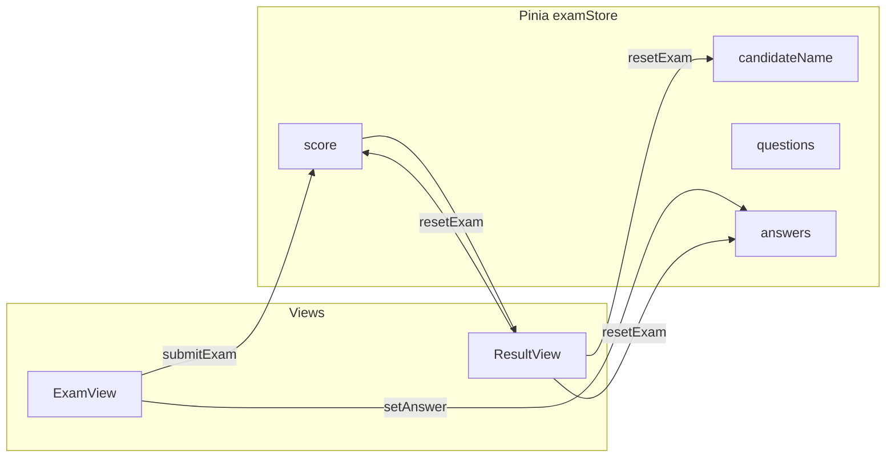
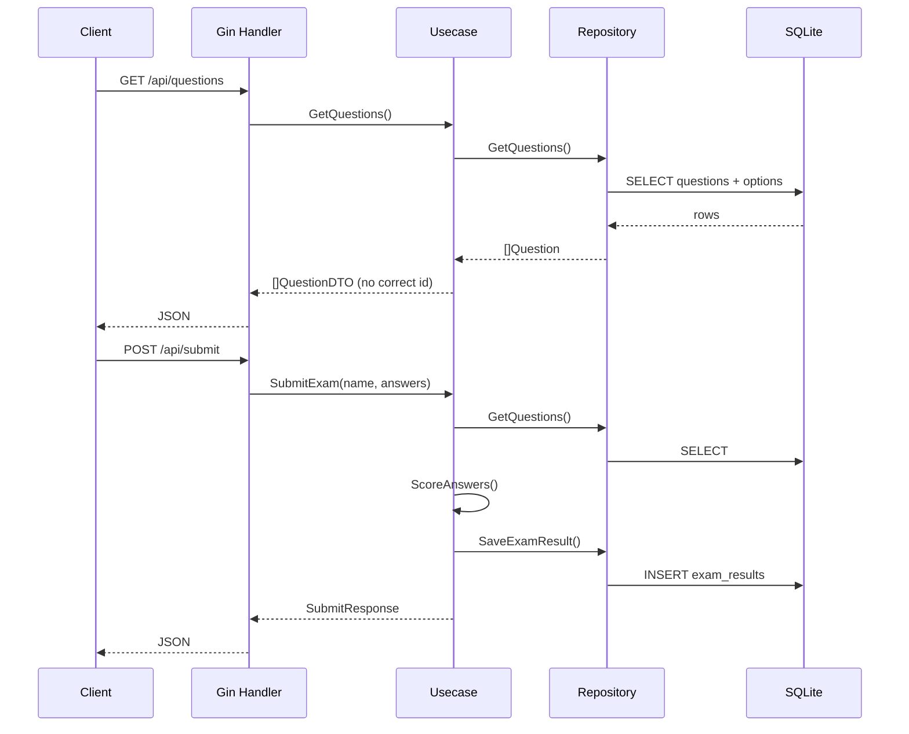

# Code Flow — Frontend, Backend & State

## สารบัญ

- [Code Flow — Frontend, Backend \& State](#code-flow--frontend-backend--state)
  - [สารบัญ](#สารบัญ)
  - [Flow ฝั่ง Frontend (ปัจจุบัน)](#flow-ฝั่ง-frontend-ปัจจุบัน)
  - [Vue Router](#vue-router)
  - [Pinia: examStore](#pinia-examstore)
  - [หน้า ExamView / ResultView](#หน้า-examview--resultview)
  - [Flow ฝั่ง Backend (Gin)](#flow-ฝั่ง-backend-gin)
  - [Usecase \& Repository](#usecase--repository)
  - [Diagram — Frontend (Mermaid)](#diagram--frontend-mermaid)
  - [Diagram — Backend request (Mermaid)](#diagram--backend-request-mermaid)

## Flow ฝั่ง Frontend (ปัจจุบัน)

1. ผู้ใช้เปิดแอป → route `/` โหลด `ExamView`
2. กรอกชื่อและเลือกคำตอบ → อัปเดต Pinia (`candidateName`, `answers`)
3. กดส่งข้อสอบ → validation → `submitExam()` คำนวณคะแนนฝั่ง client (mock questions ใน store) → `router.push` ไป `/result`
4. `ResultView` แสดงชื่อและคะแนน → สอบใหม่ → `resetExam()`

เมื่อ **ผสาน API** (Phase 6): ขั้นตอน 2–3 จะดึงคำถามจาก `GET /api/questions` และส่งคำตอบด้วย `POST /api/submit` แล้วใช้ `score` / `total` จาก response แทนการคำนวณในเบราว์เซอร์อย่างเดียว

## Vue Router

- `/` — `exam` — หน้าทำข้อสอบ
- `/result` — `result` — หน้าผล (ถ้าไม่มีคะแนนใน store จะถูกส่งกลับหน้าสอบ)

## Pinia: examStore

| State | ความหมาย |
|-------|----------|
| `candidateName` | ชื่อผู้สอบ |
| `questions` | รายการคำถาม (mock หรือจาก API ภายหลัง) |
| `answers` | `{ [questionId]: optionId }` |
| `score` | คะแนนหลังส่ง |

| Action | พฤติกรรม |
|--------|----------|
| `setAnswer` | บันทึกตัวเลือกต่อข้อ (single-choice) |
| `submitExam` | คำนวณคะแนน + ไป `/result` |
| `resetExam` | เคลียร์ state + กลับ `/` |

## หน้า ExamView / ResultView

- **ExamView:** `v-model` ชื่อ, `v-for` ข้อสอบ, ปุ่มส่งเรียก `submitExam()`
- **ResultView:** อ่าน `candidateName`, `score`, `totalQuestions`; ปุ่มสอบใหม่ → `resetExam()`

## Flow ฝั่ง Backend (Gin)

1. `cmd/api/main.go` เปิด SQLite → `AutoMigrate` → `SeedQuestionsIfEmpty` (ข้อสอบ mock ตรงกับ frontend)
2. สร้าง `QuestionGorm`, `ExamResultGorm`, ส่งเข้า `usecase.NewExam`, แล้ว `handler.NewExamHTTP`
3. Gin ลงทะเบียน `GET /api/questions`, `POST /api/submit` (มี CORS แบบง่ายสำหรับ dev)

## Usecase & Repository

| ชั้น | หน้าที่ |
|------|---------|
| **Handler** | bind JSON, เรียก usecase, ส่ง HTTP status |
| **Usecase `Exam`** | `GetQuestions` — เรียก `QuestionStore.GetQuestions` แล้วตัดเฉลยออกจาก DTO; `SubmitExam` — `GetQuestions` เพื่อได้เฉลย → `ScoreAnswers` → `ExamResultStore.SaveExamResult` |
| **Repository** | `GetQuestions` — GORM preload `Options`; `SaveExamResult` — `Create` แถว `exam_results` |

คีย์คำตอบจาก client เป็น **string** ของ question id (`"1"`, `"2"`) ให้ตรงกับ `CorrectOptionID` ในแต่ละ `Question`

## Diagram — Frontend (Mermaid)

## Diagram — Backend request (Mermaid)

